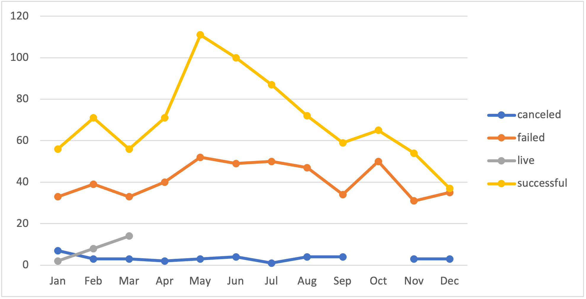
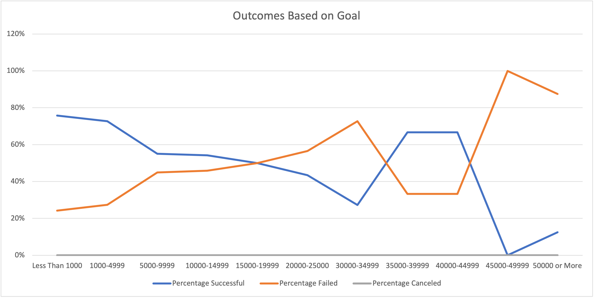

# **Kickstarting with Excel**

## **1. Overview of Project**

### a) Background

    Throughout the module, data analysis on various crowdfunding projects took place in order to uncover patterns across a multitude of variables.The following Excel data analysis were performed:

    - Filtering, formatting, and freezing
    - Conditional formating
    - Finding Averages
    - Searching for error and debugging
    - Creating pivot tables
    -  Utilizing VLOOKUP
    - Identifying measures of central tendancy and spread
    - Uncovering and adressing outliers
    - Creating box plots 

### b) Purpose

    To compare the success of differing campaigns by varying launch dates and fundraising goals. This data analysis can be achieved by organizing the data and visualizing the differing outcomes for Louise. This allows Louise to see the best times of the year to launch a play and evaluate optimal fundraising goals. 

## **2. Analysis and Challenges**

### a) Analysis of Outcomes Based on Launch Date

    In order to view the success of plays by the launch date, I first went into the 'Kickstarter' sheet to create a new column named 'years.' The information was extracted from column S, 'Data Created Conversion,' by utilizing the YEAR ()function. For instance, f(x)= YEAR(S2). After creating a pivot table using all the data from the spreadsheet 'Kickstarter,' I added the parent category and years to the filters, outcomes to columns, count of outcomes for values, and data created conversion to rows. I set the subcategory to plays, as this is what Louise is interested in evaluating. I created a line chart to show months on the x-axis and the number of plays on the y-axis. The line chart highlighted successfully, failed, and canceled plays. The line graph can change depending on the year chosen; however, in this case, it is optimal to view all years for a broad view. 

### b) Analysis of Outcomes Based on Goals

     Another helpful analysis for Eloise is organizing the data to verify if differing goal amounts correspond with higher success rates. For the columns on the spreadsheet 'Outcomes Based on Goals', I represented the number of plays that were successful, failed, canceled, the total projects, and percentages. For the rows, I inputed ranges of goal amounts that increased by $5000. 

    To calculate the number of successful, failed, and canceled plays from each column, I utilized the COUNTIFS() function. 
        - Number Sucessful Example: f(x)=COUNTIFS(Kickstarter!F:F, "=successful",  Kickstarter!R:R, "plays", Kickstarter!D:D, "<1000")
        - Number Failed Example: f(x)=COUNTIFS(Kickstarter!F:F,"=failed",   Kickstarter!R:R,"plays",Kickstarter!D:D,">=1000",Kickstarter!D:D,"<=4999")
        - Number Canceled Example: f(x)=COUNTIFS(Kickstarter!F:F, "=canceled", Kickstarter!R:R, "plays", Kickstarter!D:D, ">=50000")
            * I kept a similar format for each row but altered the ranges to fit column A.
    
    To calculate the percentages of play outcomes, the sum of the total projects needed to be performed first. This was accomplished by using the sum function to add together the values of B, C, D columns dependent on the row. Additionally, by implementing the =sum function, division of either column B, C, D by column E calculation of percentages was accomplished. After, I checked to make sure all three percentages added together reached 100% at each range. 

    Finally, a line chart was created to visualize the relationship between goal amount ranges and success/failed/canceled percentages. Only successful and failed plays were shown due to canceled plays holding no amount. 

### c) Challenges and Difficulties Encountered
     I experienced some difficulty in utilizing the COUNTIFS(). When running the equation, I would constantly get the error that the equation had too many functions. I referred back to the Kickstarter worksheet to ensure the correct data was in the right columns and there were no issues in that area. However, after attending office hours, the error was that I was using COUNTIF and not COUNTIFS. It's a small forgetful error that halted my progress. 
## **3. Results**

- What are two conclusions you can draw about the Outcomes based on Launch Date?
    1. The best time launch a play would be during the month of May. 
    2. The worst time to launch a play would be during the month of December. This month has the lowest rates of success, and is nearly equivalent to the failure rates. 

- What can you conclude about the Outcomes based on Goals?
    - Ranges of $44,999 and up is the *least* optimal fundrasing goal, as there is both a dramatic increase of failed plays and stark decrease of successful plays. 
- What are some limitations of this dataset?
    - Some limitations include the possibility of unreliable data. We are unaware of the exact sources used. Additionally, there may be a possibility that the data set is limited in size. Thus, our prediction and analyses will not be accurate. One example that incorporates these issues is the lack of data for canceled plays. This suggests the data may be inaccurate, and the data size is not representative. The issue of lack of data can also be seen with years recorded. The years registered are only from 2009 to 2017. It is critical to have the most recent data possible to make recommendations for the future. Furthermore, it would be beneficial to further subcategorize the plays in genres to visualize which subcategory of plays is the most successful. This was not possible due to a lack of data. 
- What are some other possible tables and/or graphs that we could create?
    - Depending on the country Eloise is presiding in, it would be beneficial to incorporate a pivot table and line chart that would utilize data from that country. Or, if she has a couple of countries where she would like to launch her play, we could evaluate which countries would yield the best results by looking at success, failure, and canceled percentages and rates. 
